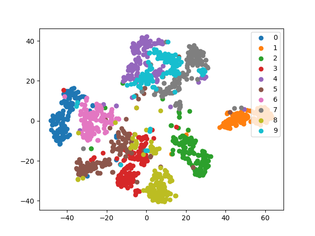

# VaDE
A PyTorch Implementation of VaDE(https://arxiv.org/pdf/1611.05148.pdf)

## Usage

First, execute `pretrain.py` to get parameters for initializing the model.

```bash
$ python pretrain.py --epochs 20 --gpu 0 --out parameters.pth
```

Then, start training like

```bash
$ python main.py --epochs 300 --gpu 0 --pretrain parameters.pth
```

The results (accuracy and visualization of the latent space)
can be confirmed by Tensorboard.

```bash
$ tensorboard --logdir runs
```


